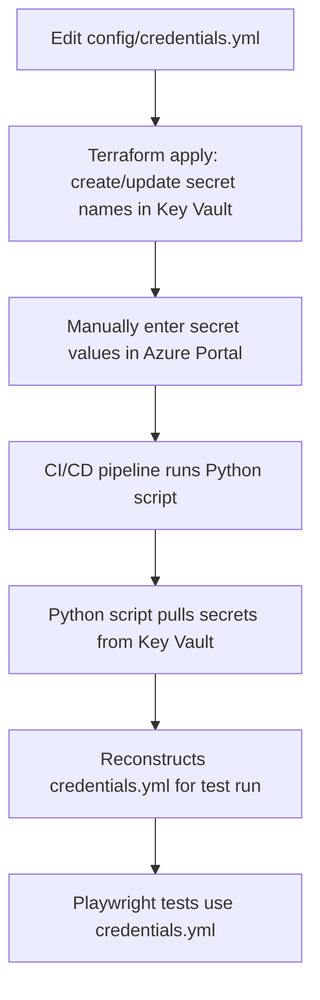

# Terraform Key Vault for EU Test Credentials

This Terraform project creates an Azure Key Vault to securely store test credentials for the EU automated testing framework.

---

## 🔄 Workflow Overview



- **Source of truth:** `config/credentials.yml` defines all secret names and structure.
- **Terraform:** Reads `credentials.yml` and creates/updates secret names in the Key Vault (values are placeholders).
- **Manual entry:** You enter the real secret values in the Azure Portal (or via automation if desired).
- **CI/CD:** The Python script (`scripts/keyvault_to_credentials.py`) pulls all secrets from the Key Vault and reconstructs a fresh `credentials.yml` for the test run.
- **Tests:** Playwright tests always use the latest credentials from the Key Vault.

---

## Overview

The project creates:
- An Azure Key Vault in an existing resource group
- Secret structures based on the `config/credentials.yml` file
- Proper access policies for secure credential management

## Prerequisites

1. **Azure CLI installed and authenticated**
   ```bash
   az login
   ```

2. **Terraform installed** (version >= 1.0)
   ```bash
   # Download from https://www.terraform.io/downloads.html
   ```

3. **Existing Azure Resource Group**
   - You must have an existing resource group where the Key Vault will be created

## Quick Start

### 1. Configure Variables

Copy the example variables file and update it:

```bash
cd terraform
cp terraform.tfvars.example terraform.tfvars
```

Edit `terraform.tfvars` with your values:

```hcl
resource_group_name = "your-existing-resource-group-name"
key_vault_name      = "eu-test-credentials-kv"
environment         = "dev"
```

### 2. Initialize Terraform

```bash
terraform init
```

### 3. Plan the Deployment

```bash
terraform plan
```

### 4. Deploy the Key Vault

```bash
terraform apply
```

### 5. Generate Secret Values for Manual Entry

Run the PowerShell script to see what secret values need to be entered manually:

```powershell
.\scripts\generate-secret-values.ps1
```

## Secret Naming Convention

Secrets are named using the following pattern:
```
{opco}-{testCategory}-{testName}
```

Examples:
- `bge-login-basic-login`
- `bge-outages-outage-reporting`
- `comed-login`

## Manual Secret Entry

After the Key Vault is created, you need to manually enter the secret values in the Azure portal:

1. **Go to Azure Portal** → Your Key Vault → Secrets
2. **For each secret**:
   - Click "Generate/Import"
   - Enter the secret name (e.g., `bge-login-basic-login`)
   - Enter the password value from your credentials
   - Set activation date to today
   - Set expiration date as needed
   - Click "Create"

## Secret Structure

Each secret contains:
- **Value**: The password for the test credentials
- **Tags**: Metadata including username, opco, test category, etc.

## Security Features

- **Soft Delete**: Enabled with 7-day retention
- **Access Policies**: Configured for current user
- **Tags**: Comprehensive tagging for organization
- **No Secret Values in Terraform**: Actual values entered manually

## Outputs

After deployment, you'll see:
- Key Vault name and ID
- Key Vault URI
- List of created secret names
- Secret details with tags

## Updating Credentials

To add new credentials:

1. **Update `config/credentials.yml`** with new credential entries
2. **Run Terraform plan** to see new secrets to be created:
   ```bash
   terraform plan
   ```
3. **Apply the changes**:
   ```bash
   terraform apply
   ```
4. **Manually enter the new secret values** in the Azure portal

## Integration with Test Framework

The test framework can be updated to read credentials from Azure Key Vault instead of the local YAML file. This would require:

1. **Azure SDK integration** in the test framework
2. **Key Vault authentication** (managed identity or service principal)
3. **Secret retrieval logic** to replace the current YAML reading

## CI/CD Usage

- The pipeline runs the Python script to pull all secrets from the Key Vault and generate a fresh `credentials.yml` before running tests.
- This ensures the test runner always uses the latest credentials from the Key Vault, matching the structure defined in `credentials.yml` and enforced by Terraform.

## Cleanup

To destroy the Key Vault and all secrets:

```bash
terraform destroy
```

**Warning**: This will permanently delete the Key Vault and all secrets!

## Troubleshooting

### Common Issues

1. **Resource Group Not Found**
   - Ensure the resource group name is correct
   - Verify you have access to the resource group

2. **Key Vault Name Already Exists**
   - Key Vault names must be globally unique
   - Change the `key_vault_name` variable

3. **Access Denied**
   - Ensure you're logged in with `az login`
   - Verify you have permissions to create Key Vaults

### Useful Commands

```bash
# Check current Azure subscription
az account show

# List resource groups
az group list --output table

# View Key Vault details
az keyvault show --name <key-vault-name> --resource-group <resource-group-name>
```

## File Structure

```
terraform/
├── main.tf                    # Main Terraform configuration
├── variables.tf               # Variable definitions
├── outputs.tf                 # Output definitions
├── create-secrets.tf          # Secret creation logic
├── terraform.tfvars.example   # Example variables file
├── README.md                  # This file
└── scripts/
    └── generate-secret-values.ps1  # PowerShell script for secret values
``` 